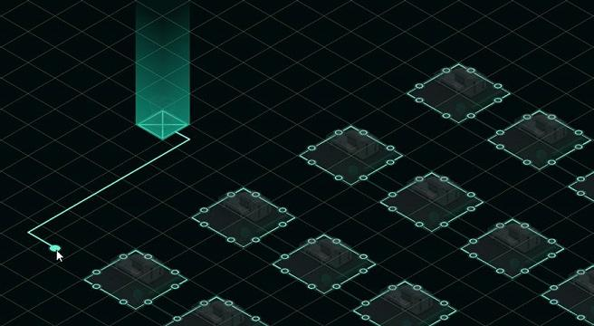
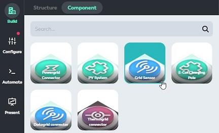
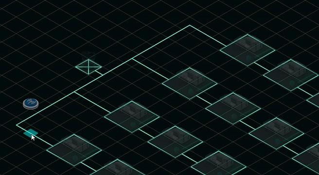
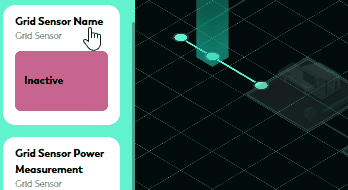
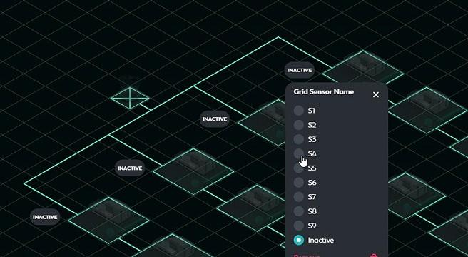
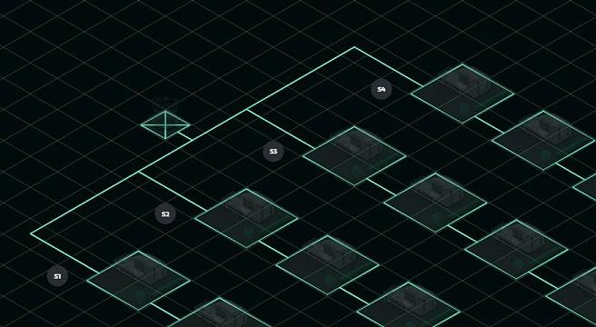
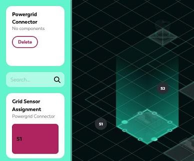
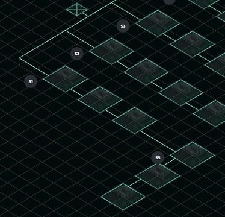

# OpenSwarm-scenarios

## Start the Scenarios

**Step 0:** (Optional) Reset the demo repository (clean up old data from former demo starts and prune the docker environment):
```sh
python ./tools/reset_for_demo.py
```

**Step 1:** zip the BSX for the demos (maybe only the ones you need):
```sh
python ./tools/zero_bsx_zip.py --story_label="Simple-Test"
python ./tools/zero_bsx_zip.py --story_label="Simple-Test-Load"
```

**Step 1a:** (Optional) Get sure, you have pulled / built the latest versions of the openswarm energy community controller docker images
* cr.siemens.com/openswarm/energy-community-controller/charger 
* cr.siemens.com/openswarm/energy-community-controller/pv
* cr.siemens.com/openswarm/energy-community-controller/sensor
* cr.siemens.com/openswarm/energy-community-controller/storage
Use
```sh
docker pull cr.siemens.com/openswarm/energy-community-controller/charger
docker pull cr.siemens.com/openswarm/energy-community-controller/pv
docker pull cr.siemens.com/openswarm/energy-community-controller/sensor
docker pull cr.siemens.com/openswarm/energy-community-controller/storage
```
to pull the latest version them from cr.siemens.com. If you want to use tagged versions, see [here](#use-previous-versions-of-the-openswarm-energy-community-controller-docker-images).

**Step 2:** Start BIFROST ZERO.
```sh
docker-compose -f ./docker/docker-compose-scenarios.yml --env-file ./env/docker.env pull
docker-compose -f ./docker/docker-compose-scenarios.yml --env-file ./env/docker.env up -d
```
and open http://127.0.0.1:9091/ 

## Save your work

Add the changes to this repo via
```sh
python ./tools/zero_bsx_get.py --story_label="Simple-Test" --operating_system="windows"
python ./tools/zero_bsx_get.py --story_label="Simple-Test-Load" --operating_system="windows"
```

After you are finished, shut down BIFROST with
```sh
docker-compose -f ./docker/docker-compose-scenarios.yml --env-file ./env/docker.env down
```

## How to Set Up a Scenario

This section explains how to build and configure the individual components of the OpenSwarm PoC 1 Use Case Demo if a demo story is being built from scratch. The focus is on enabling the system to work correctly. The configuration of the simulation itself is up to the user. Some of the following information can be found in the documentation of the respective BIFROST simulation modules.

### Grid-Sensor Placement and Correct Allocation

A grid sensor must be connected to a grid node (NODE), which in turn is connected with only two cables. This ensures that the power measurement works correctly, as the sensor randomly selects one of the cables. To do this, it is advisable to insert an "intermediate node" when pulling the cables. Here is an example in which four feeders are to be connected to a transformer:


To do this, draw a cable and double-click on an empty field to actively set a grid node:



In our example, this would result in the following scheme:


Now the individual feeders can be connected to this grid node:


Up next is to add the `Grid Sensor` component to the node. To do this, select it from the Build menu and place it on the previously created "intermediate nodes" in the power grid layer:



BIFROST helps by displaying the nodes in the network where a sensor can be placed (the area around the mouse pointer would otherwise be red if no node is available).



For clarity, it is recommended to place the sensor name as a widget in the BIFROST UI so that it is clear, where a sensor is installed. This also makes it easier to configure the remaining components. To do this, simply select the respective grid node and drag the dynamic card `Grid Sensor Name` onto the canvas with the mouse to anchor a widget:



The widget now also makes it easier to define sensor names:



Here, you should ensure that each sensor is given a unique name from the list! In our example, this would look like this:



Now all the power grid connectors of the grid must be assigned to the respective sensors. To do this, enter the name of the sensor for the respective feeder in which the power grid connector is located in the dynamic `Grid Sensor Assignment`. This must be done for all power grid connectors.



Sensors can also be cascaded. Grid sensors also have the dynamic `Grid Sensor Assignment` for this purpose. In the example below, sensor S5 would therefore have to be assigned the value “S1” as `Grid Sensor Assignment` because sensor S5 is located "behind" sensor S1 in the network. Sensors that measure at the beginning of the feeders retain the value "Unassigned" for the dynamic `Grid Sensor Assignment`.



### Grid-Sensor Measurement and Limit Configuration

Since the sensor randomly selects a cable for power measurement and the direction of the cable (in relation to the load flow, i.e. whether the cable was pulled away from or towards the node when it was created) is not known, it is possible to change the measurement direction of the load flow to assure correct sensor measurement "direction".

The dynamic `Grid Sensor Flow Direction` is available for this purpose, which can take the values “UP” and "DOWN". It is therefore advisable to carry out a test simulation and compare the expected load flow with the measured values. For example, if only load is installed in one feeder, the power measurement of the sensor should be positive. If this is not the case (values are negative), adjust the measurement direction with the dynamic `Grid Sensor Flow Direction` by changing its value.

A power limit can also be set for each grid sensor via the dynamic `Grid Sensor Power Limit`. This limit corresponds, for example, to the maximum power that the cable can handle. The community controller then ensures that this limit is not exceeded by the community operation.

### Energy-Communities and their Components

In der In the energy community, houses with PV systems, houses with e-car charging poles, solar farms and e-car charging stations can be included as components. Only one of these components should be installed per power grid connector. 
Assignment to an energy community is done with the dynamic ‘Energy Community’. Here, it is recommended to anchor this as a widget on the canvas so that the assignment can be changed dynamically during the simulation.

## Tools

Within the folder `tools` are some helper scripts (using python). For more information please use the [README](./tools/README.md) there...

## Altering Core Fragments / Structures

In this repository it is possible to start BIFROST with alternative structure fragments. The fragments in form of Typescript code can be found in [`./fragments/core`](./fragments/core/). 

To work with the full potential of these Typescript files, you can import the `bifrost-zero-common` node modules & Typescript language support with the provided `package.json`. Just install all required Node modules with (after installing [Node.JS](https://nodejs.org/en), tested with version 20.13.1, npm 10.5.2):

```sh
npm install
```

## OpenSwarm github Repository
Here some commands which where used to mirror the code.siemens.com repository to the openswarm github repository:
```sh
git remote add openswarmgithub https://github.com/openswarm-eu/bifrost-openswarm-scenarios.git
git push openswarmgithub main
git push openswarmgithub release
git push openswarmgithub v2.0.0
```

## Adding Images

BIFROST core can host your own images (to be integrated in panel cards or notifications). For this the [`./images`](./images/) folder is mapped to the `./custom/` subfolder of the public BIFROST folder. This is done via the [`docker-compose.yml`](./docker/docker-compose-scenarios.yml) file:

```yml
services:
    [...]
    bifrost-core:
        [...]
        volumes:
            - ../images/:/opt/bifrost/server/build/public/custom/
            [...]
```

You can use than a URL like http://127.0.0.1:9091/custom/[`your-image-name`] to integrate the image in present panel cards or notifications

Current available images:
- GridFailure.gif (http://127.0.0.1:9091/custom/GridFailure.gif)

## Version Handling

The idea behind demo versions is that whenever a working demo is available, it is made available in the release branch and tagged for later. Currently, this is a manual process. The following sections explain the steps required to do this.

### Release a New Demo Version

1. Merge all commits to be released into the `release` branch:
    ```bash
    git checkout release
    git merge main
    ```
2. Tag here
    ```bash
    git tag -a v2.0.0 -m "Demo running with 2.Y.Z components (community operation + grid sensors)"
    ```
3. Push the commit and tag
    ```bash
    git push
    git push origin v2.0.0
    ```
4. Continue working on the `main` branch
     ```bash
    git checkout main
    ```
5. Also give the latest versions of the openswarm energy community controller docker images a corresponding tag:
    ```bash
    docker pull cr.siemens.com/openswarm/energy-community-controller/charger
    docker pull cr.siemens.com/openswarm/energy-community-controller/pv
    docker pull cr.siemens.com/openswarm/energy-community-controller/sensor
    ```
    ```bash
    docker tag cr.siemens.com/openswarm/energy-community-controller/charger:latest cr.siemens.com/openswarm/energy-community-demo-scenarios/charger:v2.0.0
    docker tag cr.siemens.com/openswarm/energy-community-controller/pv:latest cr.siemens.com/openswarm/energy-community-demo-scenarios/pv:v2.0.0
    docker tag cr.siemens.com/openswarm/energy-community-controller/sensor:latest cr.siemens.com/openswarm/energy-community-demo-scenarios/sensor:v2.0.0
    ```
    and push them into the local registry of the demo repository with
    ```bash
    docker push cr.siemens.com/openswarm/energy-community-demo-scenarios/charger:v2.0.0
    docker push cr.siemens.com/openswarm/energy-community-demo-scenarios/pv:v2.0.0
    docker push cr.siemens.com/openswarm/energy-community-demo-scenarios/sensor:v2.0.0
    ```

### Use Previous Versions of the Openswarm Energy Community Controller Docker Images

When you want to use specific previously tagged images, you have to get sure, these are tagged as `latest`, so the community controller connector uses the correct images:
```bash
docker tag cr.siemens.com/openswarm/energy-community-demo-scenarios/charger:v2.0.0 cr.siemens.com/openswarm/energy-community-demo-scenarios/charger:latest
docker tag cr.siemens.com/openswarm/energy-community-demo-scenarios/pv:v2.0.0 cr.siemens.com/openswarm/energy-community-demo-scenarios/pv:latest
docker tag cr.siemens.com/openswarm/energy-community-demo-scenarios/sensor:v2.0.0 cr.siemens.com/openswarm/energy-community-demo-scenarios/sensor:latest
```
**ATTENTION**: Don't push these images to the CR!!! Use them only locally!!

# Acknowledgement

Part of the source code in this repository is developed within the frame and for the purpose of the OpenSwarm project. This project has received funding from the European Union's Horizon Europe Framework Program under Grant Agreement No. 101093046.


